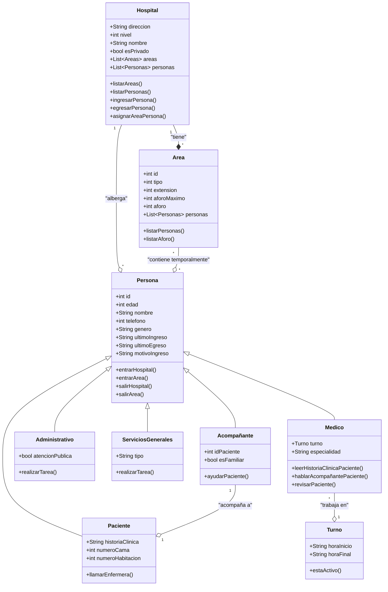

```mermaid
classDiagram
    class Persona {
        +int id
        +int edad
        +String nombre
        +int telefono
        +String genero
        +String ultimoIngreso
        +String ultimoEgreso
        +String motivoIngreso

        +entrarHospital()
        +entrarArea()
        +salirHospital()
        +salirArea()

    }
    
    class Paciente {
        +String historiaClinica
        +int numeroCama
        +int numeroHabitacion
        +llamarEnfermera()
    }
    
    class Medico {
        +Turno turno
        +String especialidad
        +leerHistoriaClinicaPaciente()
        +hablarAcompañantePaciente()
        +revisarPaciente()
    }
    
    class Administrativo {
        +bool atencionPublica
        +realizarTarea()
    }
    
    class ServiciosGenerales {
        +String tipo
        +realizarTarea()
    }
    
    class Acompañante {
        +int idPaciente
        +bool esFamiliar
        +ayudarPaciente()
    }
    
    class Area {
        +int id
        +int tipo
        +int extension
        +int aforoMaximo
        +int aforo
        +List~Personas~ personas

        +listarPersonas()
        +listarAforo()
    }
    
    class Hospital {
        +String direccion
        +int nivel
        +String nombre
        +bool esPrivado
        +List~Areas~ areas
        +List~Personas~ personas
        +listarAreas()
        +listarPersonas()
        +ingresarPersona()
        +egresarPersona()
        +asignarAreaPersona()
    }
    
    class Turno {
        +String horaInicio
        +String horaFinal
        +estaActivo()
    }
    
    %% Relaciones de herencia
    Persona <|-- Paciente
    Persona <|-- Medico
    Persona <|-- Administrativo
    Persona <|-- ServiciosGenerales
    Persona <|-- Acompañante
    
    %% Relaciones de composición/agregación
    Hospital "1" --* "*" Area : "tiene"
    Hospital "1" --o "*" Persona: "alberga"
    Area "*" --o "*" Persona : "contiene temporalmente"
    Medico "*" --o "1" Turno : "trabaja en"
    Acompañante "1" --o "1" Paciente : "acompaña a"

```