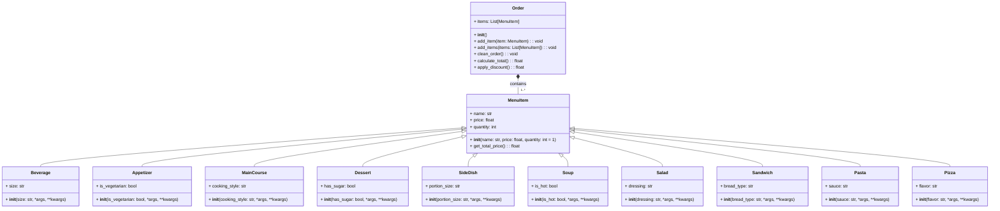

```mermaid
classDiagram
direction TB
    class MenuItem {
	    + name: str
	    + price: float
	    + quantity: int
	    + __init__(name: str, price: float, quantity: int = 1)
	    + get_total_price() : float
    }
    class Beverage {
	    + size: str
	    + __init__(size: str, *args, **kwargs)
    }
    class Appetizer {
	    + is_vegetarian: bool
	    + __init__(is_vegetarian: bool, *args, **kwargs)
    }
    class MainCourse {
	    + cooking_style: str
	    + __init__(cooking_style: str, *args, **kwargs)
    }
    class Dessert {
	    + has_sugar: bool
	    + __init__(has_sugar: bool, *args, **kwargs)
    }
    class SideDish {
	    + portion_size: str
	    + __init__(portion_size: str, *args, **kwargs)
    }
    class Soup {
	    + is_hot: bool
	    + __init__(is_hot: bool, *args, **kwargs)
    }
    class Salad {
	    + dressing: str
	    + __init__(dressing: str, *args, **kwargs)
    }
    class Sandwich {
	    + bread_type: str
	    + __init__(bread_type: str, *args, **kwargs)
    }
    class Pasta {
	    + sauce: str
	    + __init__(sauce: str, *args, **kwargs)
    }
    class Pizza {
	    + flavor: str
	    + __init__(flavor: str, *args, **kwargs)
    }
    class Order {
	    + items: List[MenuItem]
	    + __init__()
	    + add_item(item: MenuItem) : void
	    + add_items(items: List[MenuItem]) : void
	    + clean_order() : void
	    + calculate_total() : float
	    + apply_discount() : float
    }
    MenuItem <|-- Beverage
    MenuItem <|-- Appetizer
    MenuItem <|-- MainCourse
    MenuItem <|-- Dessert
    MenuItem <|-- SideDish
    MenuItem <|-- Soup
    MenuItem <|-- Salad
    MenuItem <|-- Sandwich
    MenuItem <|-- Pasta
    MenuItem <|-- Pizza
    Order *-- "1..*" MenuItem : contains
```